

  

<h1 align="center">TRENDB: IT 트렌드 분석 AI 에이전트</h1>

다양한 도구를 활용하여 IT 업계 트렌드에 대한 <b>인사이트</b>를 제공하는 지능형 에이전트

<strong>FastAPI 기반 AI 에이전트 서버</strong>

<strong>프로젝트 기간: 2024.07.10 ~ 2025.06.04</strong>

  
  
  
  
  
  
  
  
  

## 1. 프로젝트 소개

### 개발 목적
급변하는 기술 환경 속에서 실시간으로 쏟아지는 방대한 정보들을 한눈에 파악하고, 비즈니스 변화에 신속하게 대응하는 것은 모든 기업의 중요한 과제입니다. **TRENDB**는 이러한 필요성에 따라 임직원들이 최신 IT 트렌드를 놓치지 않고, 데이터에 기반하여 올바른 방향성을 설정할 수 있도록 지원하기 위해 개발되었습니다.

**TRENDB**는 기존 거대 언어 모델(LLM)의 한계인 환각 현상을 줄이고, 신뢰할 수 있는 최신 정보를 제공하는 것을 핵심 목표로 삼습니다. 이를 위해 데이터 수집 파이프라인, AI 에이전트 서버, 메인 API 서버를 분리한 구조로 서비스 전반을 설계했습니다.

이 중 `langchain-trend-agent` 레포는 FastAPI 기반의 AI 에이전트 서버로서, 사용자의 질문을 분석하고 적절한 도구를 선택해 실행한 뒤, 결과를 종합하여 스트리밍 응답과 출처를 생성합니다. 또한 팀 문서 기반 질의응답과 파일 첨부 기반 컨텍스트 확장 기능을 함께 제공하여, 검색, 분석, 생성, 검증이 하나의 흐름 안에서 이어지는 사용자 경험을 구현합니다.

사용자는 이 서버를 통해 하나의 서비스 안에서 다음 흐름을 자연스럽게 이어갈 수 있습니다.

- 국내외 뉴스, 웹, 커뮤니티, 논문, 영상 정보를 통합적으로 탐색
- 기간별 트렌드, 경쟁사 동향, 주식 데이터 등 분석 결과 확인
- AI 챗봇과의 스트리밍 대화 및 페르소나 기반 응답 이용
- 팀 문서 업로드 후 문서 기반 질의응답 수행

### 저장소 역할

- `langchain-trend-agent` 레포는 FastAPI 기반의 AI 에이전트 서버입니다.
- LangChain 기반 에이전트가 15개의 도구를 조합해 검색, 분석, 생성 작업을 수행합니다.
- 뉴스 검색, 웹 검색, 커뮤니티 탐색, 논문 검색, 주식 분석, 이미지 생성, 문서 기반 질의응답을 담당합니다.
- 메인 API 서버와 데이터 수집 파이프라인이 연결된 상태에서, 최종 사용자에게 근거 기반 응답과 스트리밍 결과를 제공합니다.

---

## 2. 핵심 기능 및 구현

TRENDB의 핵심은 **LangChain 기반 자율형 에이전트**가 사용자의 질문을 분석하고, 등록된 **15개의 도구**를 조합해 하나의 응답으로 정리하는 데 있습니다. 에이전트는 뉴스 검색, 웹 검색, 커뮤니티 탐색, 시계열 분석, 문서 기반 질의응답, 이미지 생성, 리포트 생성을 상황에 맞게 조합하며, 이 과정에서 생성된 시각화 자료는 S3에 업로드되어 이미지 형태로 함께 제공됩니다.

### 2.1. 시장 및 트렌드 분석

- **트렌드 키워드 분석**: 국내 뉴스 데이터를 기반으로 기간별(일/주/월) 트렌드 키워드를 추출하고, 언급량과 긍부정 분포를 차트로 시각화하여 기사 본문 요약과 함께 제공합니다.
- **경쟁사 동향 분석**: 지정된 경쟁사들의 뉴스 언급량 및 긍부정 추이를 분석하고, 관련 대표 기사를 함께 제시하여 비교 분석을 지원합니다.
- **구글 트렌드 분석**: `pytrends`를 활용하여 특정 키워드의 관심도 변화를 시계열 그래프로 시각화해 대중의 관심도 추이를 직관적으로 보여줍니다.
- **국내외 주식 분석**: `FinanceDataReader`와 `yfinance`를 통해 국내외 주식의 OHLCV 데이터를 조회하고, 종가 및 거래량 차트를 생성하여 시장 반응을 분석합니다.

  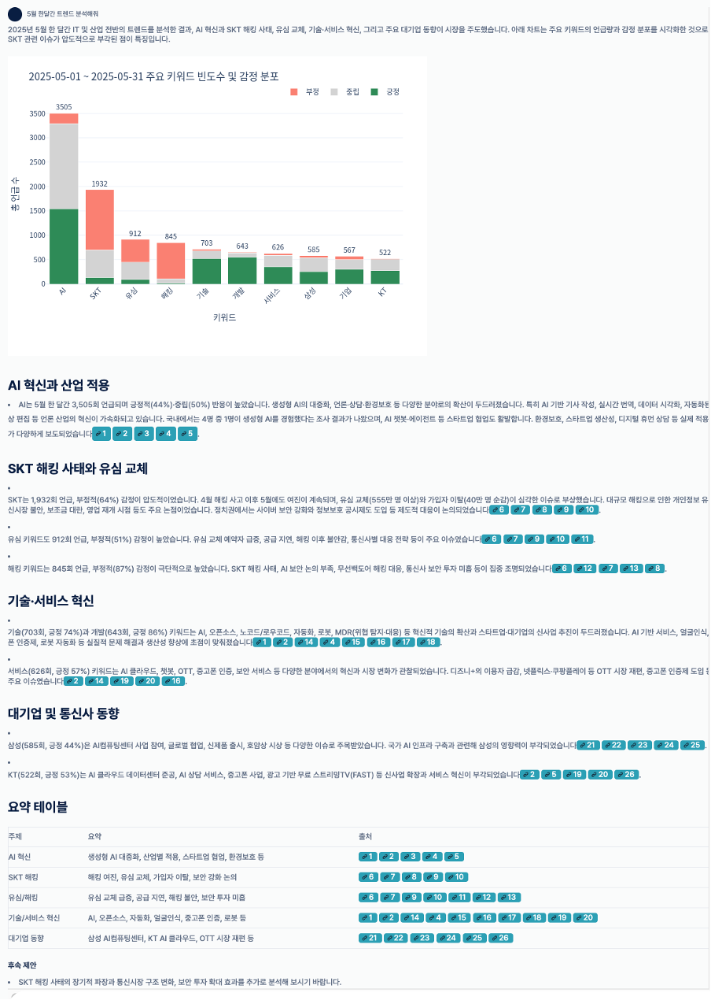
  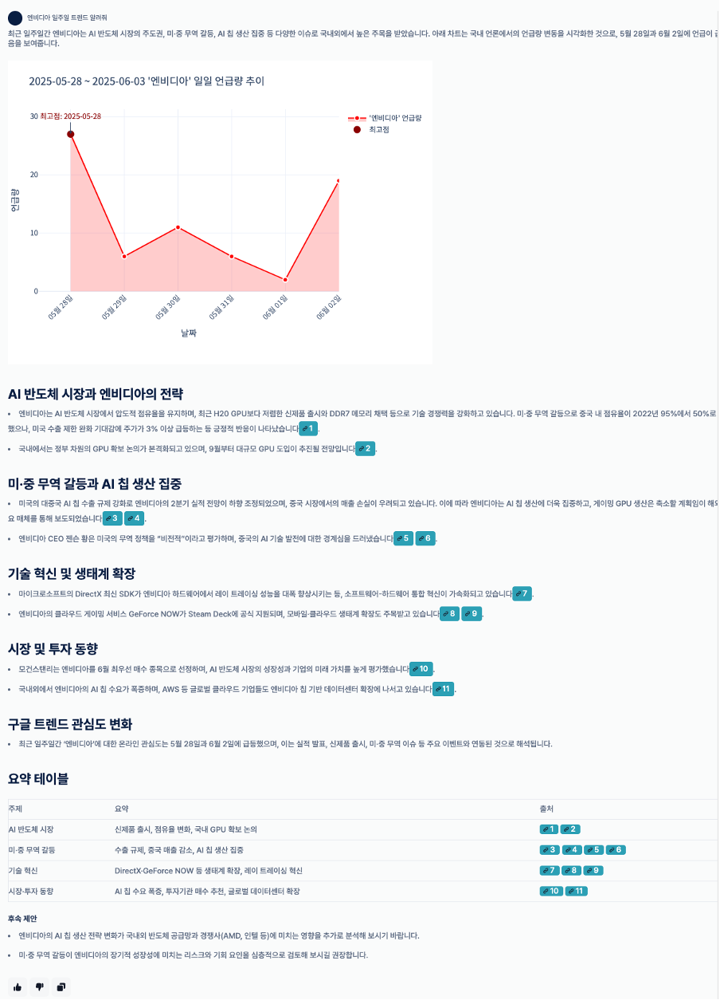
   
  <em>기간별 상위 키워드 트렌드 분석(좌) 및 특정 키워드 심층 분석(우)</em>

  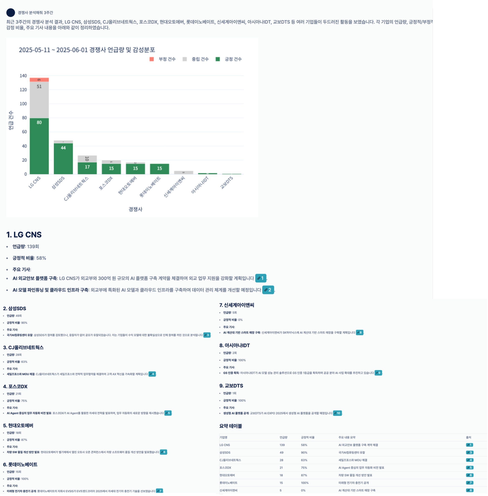
   
  <em>경쟁사별 뉴스 언급량 및 긍부정 분포 분석</em>

  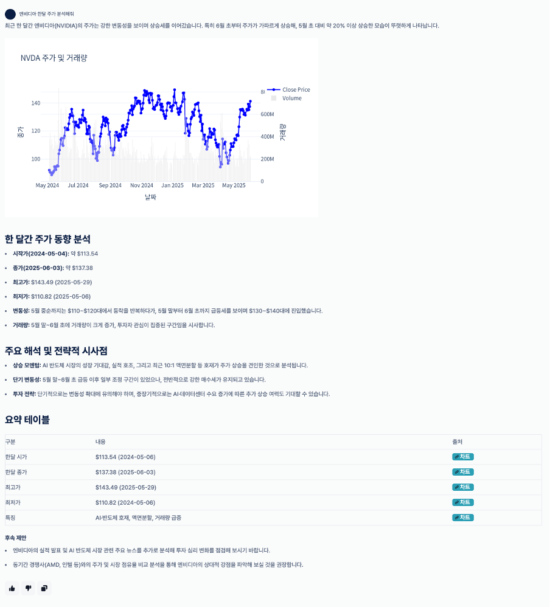
   
  <em>주가 및 거래량 변동 추이 시각화</em>

### 2.2. 다중 소스 정보 검색 및 분석

- **국내외 뉴스 검색**: 자체 구축한 Elasticsearch 뉴스 데이터베이스에서 국내외 기사를 실시간으로 검색하고, 핵심 내용을 요약하여 제공합니다.
- **웹 및 커뮤니티 검색**: Tavily 웹 검색, 네이버/다음 블로그, Reddit, X(Twitter) 등 다양한 채널을 병렬로 탐색하여 최신 정보와 여론을 종합적으로 수집합니다.
- **전문 정보 검색**: Wikipedia, 나무위키, OpenAlex(학술 논문), YouTube 등 특정 도메인에 특화된 검색을 수행하여 정보의 깊이와 신뢰도를 높입니다.
- **웹/문서 내용 추출**: 사용자가 제공한 URL(웹페이지, PDF)의 텍스트를 직접 추출하고 분석하여 별도의 검색 없이 원하는 정보에 바로 접근할 수 있습니다.

  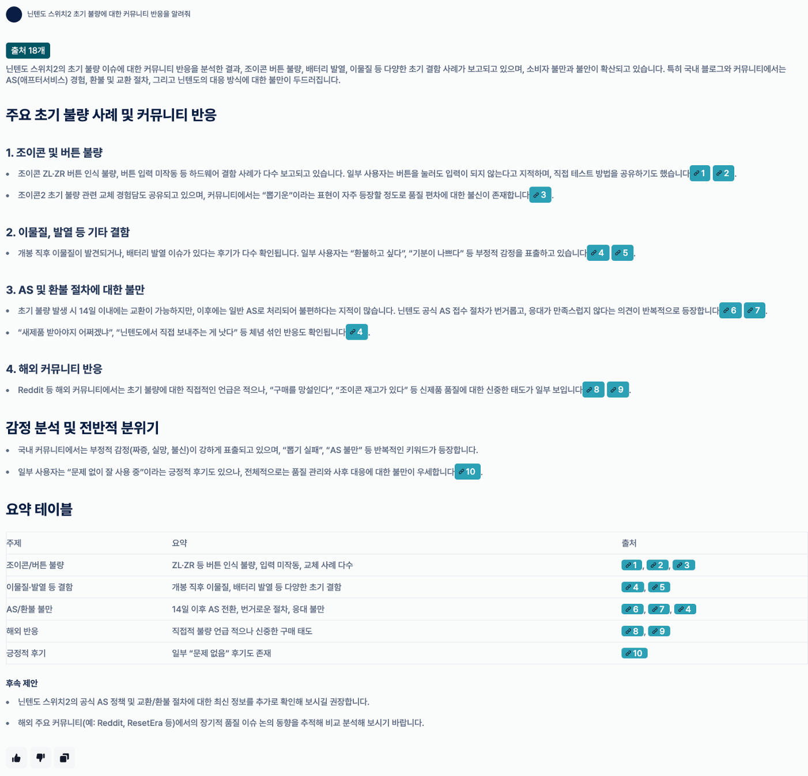
   
  <em>다중 커뮤니티 동시 검색 결과</em>

  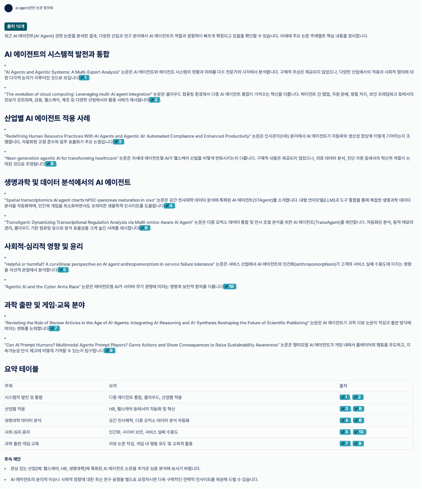
  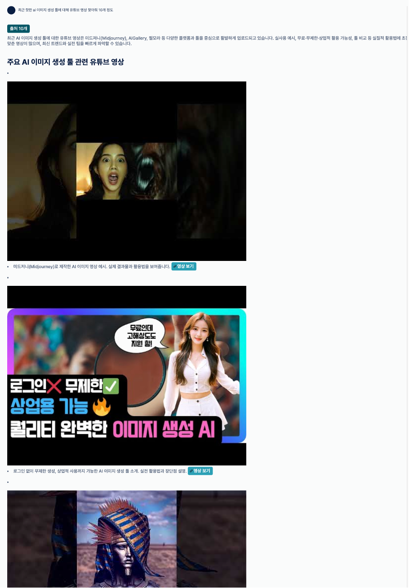
   
  <em>논문 검색(좌) 및 유튜브 영상 검색(우)</em>

  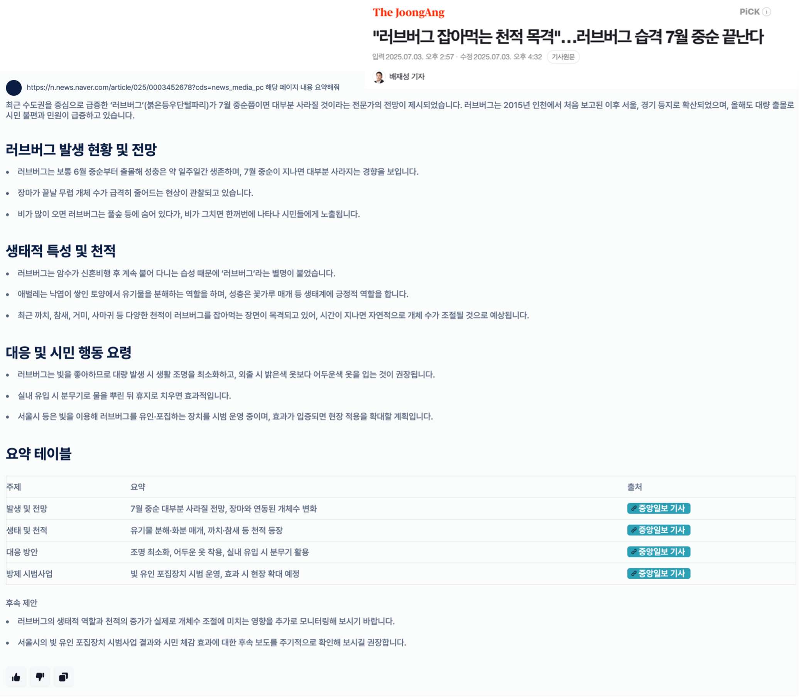
   
  <em>URL 기반 웹페이지 내용 추출 및 요약</em>

### 2.3. 콘텐츠 생성 및 지식 확장

- **자동 리포트 생성**: 여러 분석 도구의 결과를 종합하고, LLM이 서술형 분석까지 더한 전문적인 트렌드 리포트(DOCX)를 자동으로 생성합니다.
- **AI 이미지 생성**: DALL-E 3를 활용하여 사용자의 아이디어를 즉시 시각적인 이미지로 구체화합니다.
- **팀 문서 기반 RAG**: 팀 전용 클라우드에 문서(PDF, DOCX, TXT)를 업로드하면 시스템이 자동으로 텍스트를 추출하고 의미 단위로 분할한 뒤 벡터 임베딩으로 변환하여 **Milvus**에 저장합니다. 이후 사용자가 팀 문서에 대해 질문하면, 유사도가 높은 문서 내용을 찾아 답변의 근거로 활용합니다.
- **문서 파일 첨부**: 대화 시 문서 파일(PDF, DOCX, HWP, TXT)을 첨부하면, 해당 파일에서 텍스트를 추출해 현재 대화의 문맥에 반영합니다. 이를 통해 AI 에이전트는 첨부된 파일 내용을 기반으로 보다 정확한 응답을 생성할 수 있습니다.

  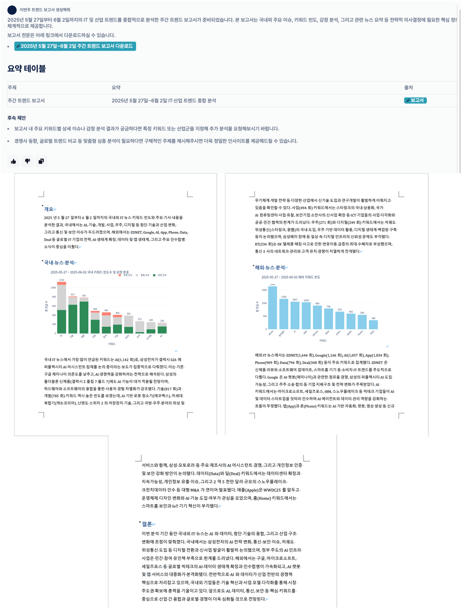
   
  <em>자동 생성된 트렌드 리포트(DOCX) 다운로드</em>

  
   
  <em>DALL-E 3를 활용한 이미지 생성</em>

  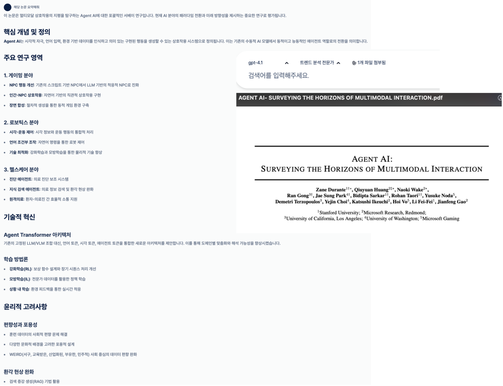
   
  <em>업로드된 파일을 기반으로 한 질의응답</em>

### 2.4. 에이전트 시스템

- **유연한 LLM 모델 선택**: GPT-4.1, GPT-4o-mini, Claude Sonnet, Grok-3 등 여러 LLM을 사용자가 직접 선택하여 목적에 맞는 응답 전략을 구성할 수 있습니다.
- **사용자 맞춤형 페르소나**: 시스템에서 제공하는 프리셋을 사용하거나, 사용자가 직접 챗봇의 말투, 어조, 역할을 정의하는 커스텀 페르소나를 생성하여 개인화된 사용자 경험을 제공합니다.
- **실시간 도구 실행 상태 제공**: 에이전트가 답변을 생성하기 위해 어떤 작업을 수행하고 있는지 실시간으로 스트리밍하여, 사용자가 응답 생성 과정을 투명하게 확인할 수 있도록 했습니다.
- **채팅방 제목 자동 생성**: 채팅방의 첫 번째 질문이 입력되면, LLM이 해당 질문의 핵심 내용을 요약하여 채팅방 제목으로 설정합니다. 이를 통해 사용자는 각 대화의 주제를 쉽게 식별할 수 있습니다.

  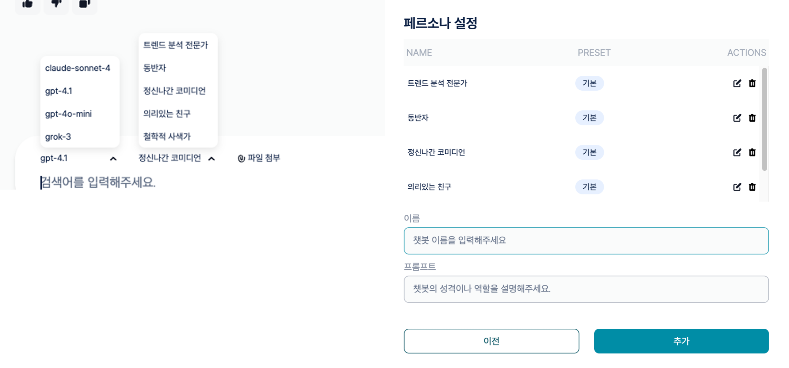
   
  <em>LLM 모델 선택 및 사용자 맞춤형 페르소나 설정</em>

### 2.5. 신뢰성 및 투명성

- **실시간 출처 제공 및 검증**: 에이전트는 답변을 생성할 때 활용한 뉴스 기사, 웹페이지, 논문, 영상 등의 출처를 함께 제공합니다. 이를 통해 사용자는 결과의 근거를 바로 확인하고 직접 검증할 수 있어 답변의 신뢰도를 높일 수 있습니다.

  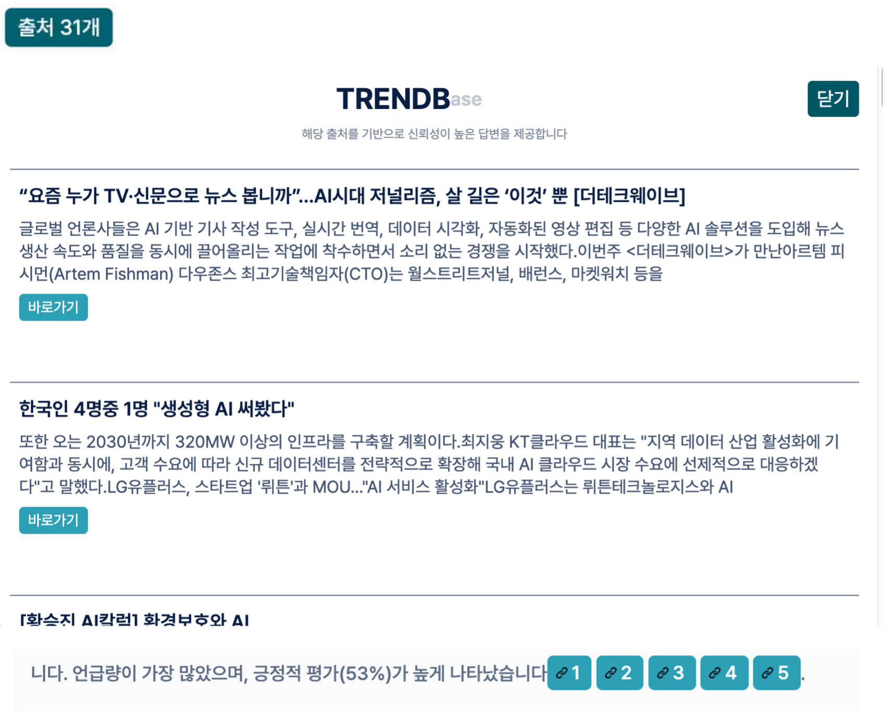
   
  <em>실시간으로 제공되는 답변 및 출처 정보</em>

---

## 3. 기술 스택

| 구분 | 기술 | 상세 설명 |
|---|---|---|
| **Backend** | `FastAPI`, `Python 3.10` | 비동기 기반 AI 에이전트 API 서버 구축 |
| **LLM & AI** | `LangChain`, `OpenAI GPT-4.1`, `GPT-4o-mini`, `Claude Sonnet`, `Grok-3`, `DALL-E 3` | 에이전트, 체인, 메모리, 도구 호출형 응답 생성 및 이미지 생성 |
| **Database** | `PostgreSQL`, `Milvus`, `Elasticsearch`, `Redis` | 채팅/사용자 데이터 관리, 벡터 임베딩 저장, 뉴스 데이터 검색, 캐시 처리 |
| **Infrastructure** | `AWS (EC2, S3)`, `Google Compute Engine`, `Docker` | 서버 운영, 시각화 결과 저장, 컨테이너 기반 실행 환경 구성 |
| **Monitoring & Mgt.** | `LangSmith`, `Kibana`, `Attu`, `DBeaver` | 에이전트 추적, 데이터 탐색, 벡터 DB 및 관계형 DB 관리 |
| **DevOps** | `GitHub Actions`, `Jenkins` | FastAPI 배포 자동화, 데이터 수집 및 운영 자동화 연계 |
| **Core Libraries** | `Pandas`, `NumPy`, `Pydantic`, `Plotly`, `TavilySearch`, `BeautifulSoup`, `FinanceDataReader`, `yfinance`, `pytrends`, `python-docx`, `PyMuPDF` | 데이터 처리, 유효성 검증, 시각화, 검색, 리포트 생성, 문서 파싱 |

---

## 4. 관련 저장소

TRENDB는 역할을 분리한 저장소들이 함께 동작하는 구조입니다.

- **AI 에이전트 서버 (FastAPI)**: 현재 저장소. LangChain 기반 에이전트와 15개의 도구를 통해 사용자의 질문을 해석하고, 검색·분석·생성 결과를 종합하여 스트리밍 응답을 생성합니다.
- **메인 API 서버 (Spring Boot)**: [server](https://github.com/CAPSTONE-DBFIS/server) - 사용자 인증(JWT), 회원 관리, 팀 생성 및 관리, 팀 파일 클라우드, 인사이트 대시보드 API 등 핵심 비즈니스 로직을 담당합니다.
- **데이터 수집 파이프라인 (Python Scripts & Jenkins)**: [global-it-news-analysis](https://github.com/CAPSTONE-DBFIS/global-it-news-analysis) - 국내외 IT 뉴스를 수집하고 키워드, 연관 키워드, 긍부정 분석 데이터를 생성하여 Elasticsearch와 PostgreSQL에 적재합니다.

---

## 5. 시스템 아키텍처 및 데이터 흐름

  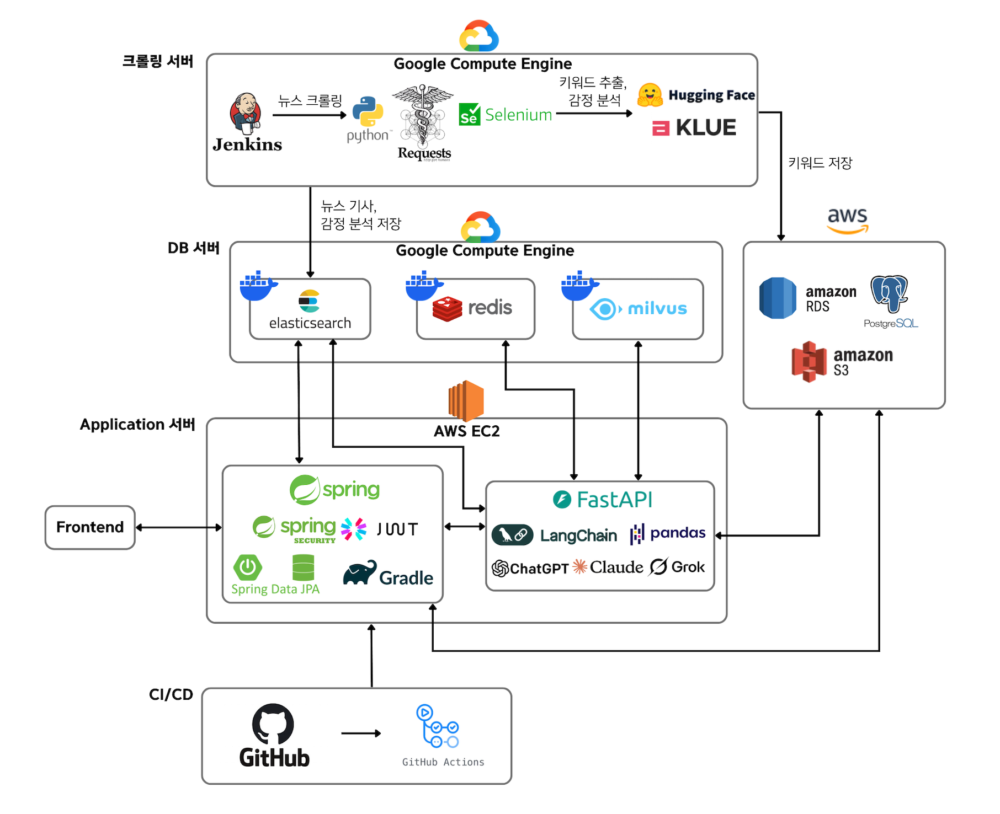

TRENDB가 사용하는 핵심 뉴스 데이터는 별도의 자동화된 파이프라인을 통해 구축됩니다. **Jenkins**를 사용해 매일 국내외 IT 뉴스를 수집하고, 기사 원문과 긍부정 결과, confidence는 **Elasticsearch**에 저장하며, 키워드와 연관 키워드 집계 결과는 **PostgreSQL**에 저장합니다. AI 에이전트 서버는 이 데이터를 기반으로 최신 트렌드 분석과 근거 중심 응답을 생성합니다.

### 응답 처리 흐름

  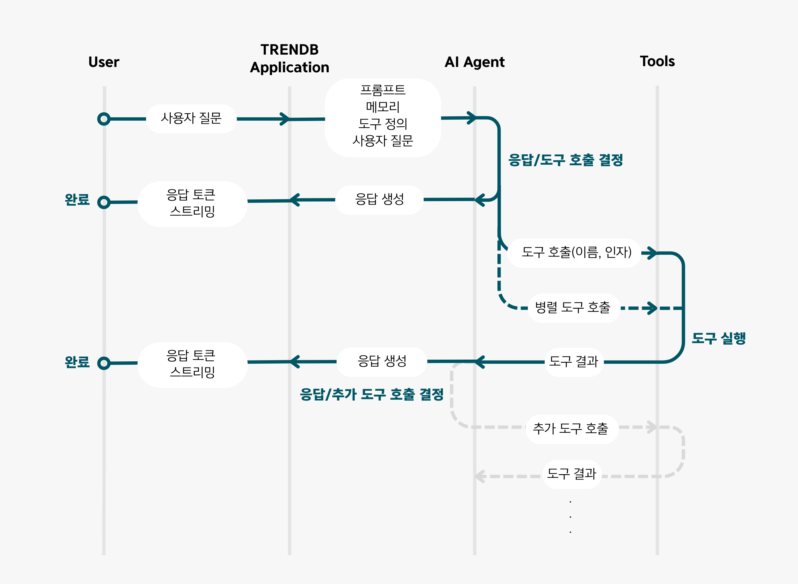

1. **API 요청 (`/agent/query`)**: 사용자가 질문과 함께 파일, 페르소나 ID, 채팅방 정보 등을 FastAPI 서버로 전송합니다.
2. **컨텍스트 준비 (`AgentChatService`)**:
   - `get_session_history`: PostgreSQL에서 이전 대화 기록을 불러와 메모리에 주입합니다.
   - `get_user_persona`: 사용자가 선택한 페르소나 정보를 조회합니다.
   - `extract_text_by_filename`: 업로드된 파일이 있는 경우 텍스트를 추출해 현재 대화 문맥에 반영합니다.
3. **에이전트 초기화**: 시스템 프롬프트, 메모리, 15개의 도구를 결합하여 `AgentExecutor`를 구성합니다. LLM은 사용자가 선택한 모델로 동적으로 초기화됩니다.
4. **자율적 도구 실행**:
   - 에이전트가 질문을 분석해 국내외 뉴스 검색, 트렌드 분석, 커뮤니티 탐색, 논문 검색, 주식 분석, 이미지 생성 등 필요한 도구를 선택하여 실행합니다.
   - 도구 실행 로그와 중간 상태는 SSE(Server-Sent Events)를 통해 실시간으로 스트리밍됩니다.
5. **결과 종합 및 최종 응답 생성**:
   - 도구 실행 결과를 종합해 최종 답변을 생성합니다.
   - 답변과 함께 관련 링크 및 출처 정보도 함께 스트리밍됩니다.
6. **DB 저장**: 응답 생성이 완료되면 대화 내용을 PostgreSQL에 저장하고, 첫 질문인 경우 채팅방 제목도 자동으로 갱신합니다.

---

## 6. API 엔드포인트

| HTTP Method | 경로 | 설명 |
|---|---|---|
| `POST` | `/agent/query` | AI 에이전트에게 질문하고 스트리밍 응답을 받습니다. |
| `POST` | `/team-files` | 팀 파일을 업로드하고 Milvus에 벡터 임베딩을 저장합니다. |
| `DELETE` | `/team-files/{team_id}/{file_id}` | 특정 팀 파일과 관련된 벡터 임베딩을 삭제합니다. |
| `POST` | `/team-file/query` | 팀 파일 기반으로 RAG 질의응답을 수행합니다. |

---

## 7. 브랜치 전략

- **`main`**: 안정화된 최종 버전이 관리되는 브랜치입니다. GitHub Actions와 연동되어 `main` 브랜치 반영 시 자동 배포가 진행됩니다.
- **`develop`**: 다음 출시 버전을 개발하는 브랜치입니다. 기능 개발이 완료되면 `feature` 브랜치에서 `develop`으로 병합됩니다.
- **`feature/*`**: 신규 기능 개발 및 버그 수정을 위한 브랜치입니다. `develop`에서 분기하며, 개발 완료 후 다시 `develop`으로 Pull Request를 보냅니다.
